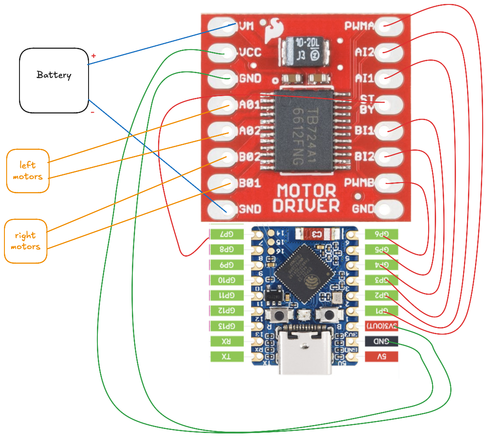

# ESP32 Micro RC Car

A BLE-controlled 4WD RC car built with ESP32-S3 and written in Rust. Control it from your phone's browser using Web Bluetooth.

## Demo

[](https://www.youtube.com/shorts/cgP8P8uSG38)

## Hardware

- ESP32-S3 (Waveshare Zero)
- TB6612FNG motor driver
- 4x 716 coreless motors (3.7V)
- 3.7V Li-Po battery
- A Li-Po battery charger (Optional)
    - I used a clone of the Adafruit Micro-Lipo charger
    - Can also use much cheaper TP4056 based ones which are available for $0.1 or INR10 or so. But need to take care of charging current with them.
- Switch to turn the car on/off (Optional)

## Wiring

### Notes
- You can simplify the connections further by:
    - tying battery `+` together with Vm of motor driver and 5V pin of ESP32.
    - tying battery `-` together with GND of motor driver and GND of ESP32.
- Lipo charger and on/off switch are not shown in the circuit. You can add the charger to battery terminals and charger output as below. And a switch can be optionally added to ESP32 5v input.



## Building and Flashing

Make sure you have the Rust ESP toolchain installed:

```bash
# Build
cargo build --release
# Flash/Run
cargo espflash flash --monitor --log-format defmt --release
```

## Control Interface

### Web Browser (Works on Desktop or Android)

Open `web/index.html` in Chrome or Edge to connect via Web Bluetooth. Use the virtual joystick to drive.

### iOS App

iOS browsers dont support Web Bluetooth so we need an app to control from iPhone. Make an xcode project and use the code under `iOS` folder to compile/install the app on your iPhone.
